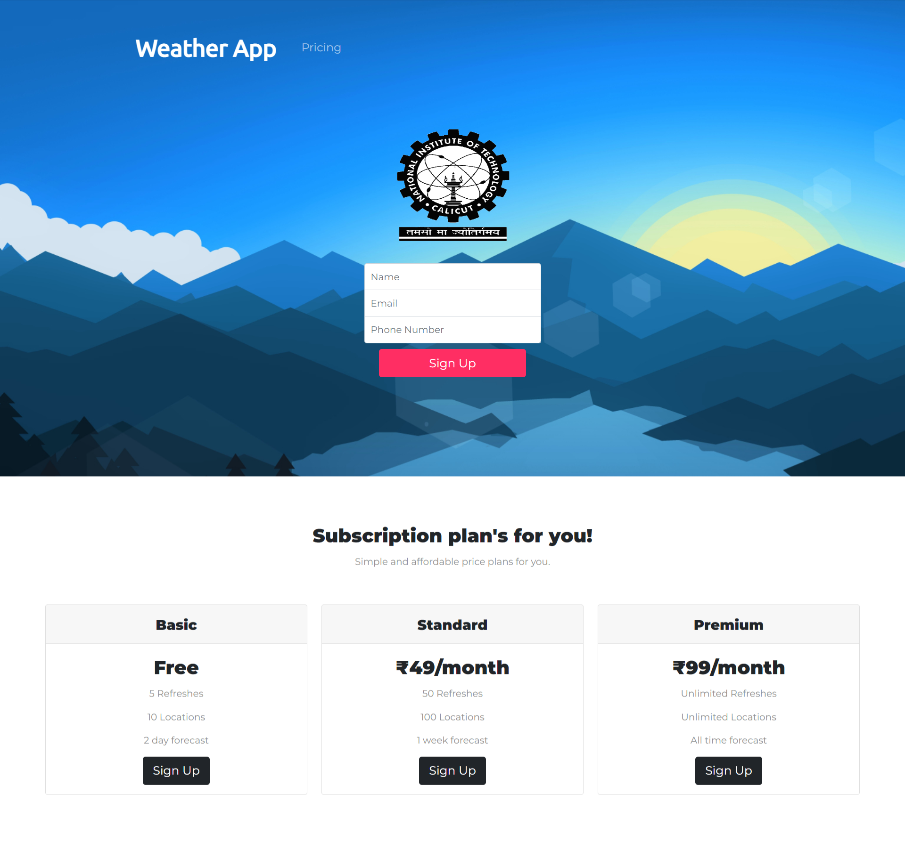

# Weather App

This app display weather data and 5 day forecast  from any city in the world using the [OpenWeatherMap](http://www.openweathermap.org/) API.

## Screenshot

## Demo
You can view the working demo here: [https://phantom3lue.github.io/](https://phantom3lue.github.io/)

## Features
- It can show weather by Geolocation
- It shows weather by entering the city name

## Tools/Languages
The following are the languages or tools I used to build the app:

- Html and Css
- JavaScript
- [Open Weather API](http://api.openweathermap.org)
